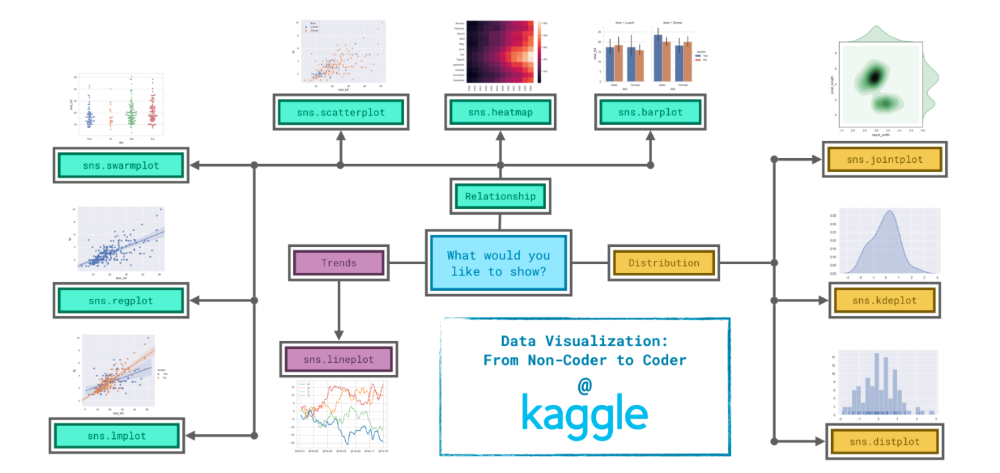

# Introduction
Data visualizations to the next level with seaborn, a powerful but easy-to-use data visualization tool.
you'll learn about many different plot types.

## Visualization Methods : Line Plots, Bar Plots & Heatmaps
  1. load the data
  2. set the size
  3. select the visualization method

~~~
fpath = "../database.csv"
# we set the value of the first column (index_col) to the name of the first column "Date"
# parse_dates set each row label as a date (as opposed to a number or other text with a different meaning)
fhand = pd.read_csv(fpath, index_col='Date', parse_dates=True)

# Print the first five rows of the data
museum_data.head()
# Print the last five rows of the data
museum_data.tail()

# ## Line Plot

# set width and height of the figure in inches
plt.figure(figsize=(16,6))

# Add title
plt.title('This is the title of the whole chart')

# line chart showing evolution over time
# sns indicates that the command comes from the seaborn package
# data=fhand selects the data that will be used to create the chart
sns.lineplot(data=fhand)

# Plot only selected columns
sns.lineplot(data=fhand['column B'], label='Song 1')
sns.lineplot(data=fhand['column C'], label='Song 2')

# Add label for horizontal axis (bottom)
plt.xlabel('Date')

# ## Bar Chart
# set width and height of the figure in inches
plt.figure(figsize=(16,6))

# this bar chart sets the data to x axis and y axis choosing columns from between all the data columns
# x=flight_data.index - determines what to use on the horizontal axis, the column that indexes the rows (the column containing the months).
# y=flight_data['NK'] - sets the column that determine the height of each bar. In this case, we select the 'NK' column.
sns.barplot(x=flight_data.index, y=flight_data['NK'])

# Important Note: You must select the indexing column with flight_data.index, and it is not possible to use flight_data['Month'] (which will return an error). This is because when we loaded the dataset, the "Month" column was used to index the rows. We always have to use this special notation to select the indexing column.

# Add label for vertical axis
plt.ylabel("Arrival delay (in minutes)")

# ## Heatmap
# Heatmap showing average arrival delay for each airline by month
# annot=True - This ensures that the values for each cell appear on the chart. (Leaving this out removes the numbers from each of the cells!)
sns.heatmap(data=flight_data, annot=True)

# ## Resume
sns.lineplot(data=fhand)
sns.barplot(x=flight_data.index, y=flight_data['NK'])
sns.heatmap(data=flight_data, annot=True)
~~~

## Scatter Plots (Diagrama de dispersión - regresión lineal) Numeric & Categorical
Para identificar el tipo de relación (si existe) entre dos variables cuantitativas. El diagrama de dispersión mostrará el grado de correlación (no causalidad) entre las dos variables. Para una correlación lineal, el procedimiento de ajuste es conocido como **regresión lineal**.

~~~
# fhand
insurance_data = pd.read_csv("../input/insurance.csv")

# ## Numeric Scatter Plot

# simple scatter plot (no regression line)
sns.scatterplot(x=insurance_data['bmi'],y=insurance_data['charges'])

# linear regresion scatter plot (with regression line)
sns.regplot(x=insurance_data['bmi'],y=insurance_data['charges'])

# Color-coded scatter plots
sns.scatterplot(x=insurance_data['bmi'], y=insurance_data['charges'], hue=insurance_data['smoker'])

# two regression lines
sns.lmplot(x="bmi", y="charges", hue="smoker", data=insurance_data)

# ## Categorical Scatter Plot
sns.swarmplot(x=insurance_data['smoker'], y=insurance_data['charges'])

# ##Resume
sns.regplot(x=insurance_data['bmi'],y=insurance_data['charges'])
sns.scatterplot(x=insurance_data['bmi'], y=insurance_data['charges'], hue=insurance_data['smoker'])
sns.lmplot(x="bmi", y="charges", hue="smoker", data=insurance_data)
sns.swarmplot(x=insurance_data['smoker'], y=insurance_data['charges'])

~~~

## Histograms (Histogramas)
En estadística, un histograma es una representación gráfica de una variable en forma de barras, donde la superficie de cada barra es proporcional a la frecuencia de los valores representados.  **Ofrece una visión de grupo permitiendo observar una tendencia** o preferencia por parte de la muestra, mediante la inclinación hacia una determinada región de valores dentro del espectro de valores posibles que pueda adquirir la característica.

Se utiliza en las muestras para evidenciar comportamientos, observar el grado de homogeneidad, el grado de variabilidad o dispersión, también es posible no evidenciar ninguna tendencia y obtener que la característica adquiere un valor aleatoriamente sin mostrar ninguna preferencia o tendencia, entre otras cosas.

Se utilizan para relacionar variables cuantitativas continuas, en contraposición, para variables cuantitativas discretas las barras se dibujan separadas y el gráfico se llama diagrama de frecuencias, porque la variable representada en el eje horizontal ya no representa un espectro continuo de valores, sino valores cuantitativos específicos, igual que ocurre en un diagrama de barras, usado para representar una característica cualitativa o categórica.

~~~
# Read the file
iris_data = pd.read_csv("../input/iris.csv", index_col="Id")

# ## Histograma
# We customize the behavior of the command with two additional pieces of information:
# a= chooses the column we'd like to plot (in this case, we chose 'Petal Length (cm)').
# kde=False is something we'll always provide when creating a histogram, as leaving it out will create a slightly different plot.
sns.distplot(a=iris_data['Petal Length (cm)'], kde=False)

# ## Density plots (KDE plot)
sns.kdeplot(data=iris_data['Petal Length (cm)'], shade=True)

# 2D KDE plots
sns.jointplot(x=iris_data['Petal Length (cm)'], y=iris_data['Sepal Width (cm)'], kind="kde")

## Color-coded plots

# Histogram

# break the dataset by three, we create a different histogram for each species, We use label= to set how each histogram will appear in the legend.
sns.distplot(a=iris_set_data['Petal Length (cm)'], label="Iris-setosa", kde=False)
sns.distplot(a=iris_ver_data['Petal Length (cm)'], label="Iris-versicolor", kde=False)
sns.distplot(a=iris_vir_data['Petal Length (cm)'], label="Iris-virginica", kde=False)

# Force legend to appear
plt.legend()

# KDE plot
sns.kdeplot(data=iris_set_data['Petal Length (cm)'], label="Iris-setosa", shade=True)
sns.kdeplot(data=iris_ver_data['Petal Length (cm)'], label="Iris-versicolor", shade=True)
sns.kdeplot(data=iris_vir_data['Petal Length (cm)'], label="Iris-virginica", shade=True)

~~~

# Organize the charts
To decide how to best tell the story behind your data, we've broken the chart types into three broad categories:

  * Trends - A trend is defined as a pattern of change.
    + sns.lineplot : Line charts best show trends over a period of time, and multiple lines can be used to show trends in more than one group.
    +
    +
  * Relationship - To understand relationships between variables.
    + sns.barplot - (Bar charts) useful for comparing quantities corresponding to different groups.
    + sns.heatmap - (Heatmaps) used to find color-coded patterns in tables of numbers.
    + sns.scatterplot - show the relationship between two continuous variables; if color-coded, we can also show the relationship with a third categorical variable.
      - sns.regplot - Including a regression line.
      - sns.lmplot - Multiple regression lines, if the scatter plot contains multiple, color-coded groups.
    + sns.swarmplot - Categorical scatter plots show the relationship between a continuous variable and a categorical variable.
  * Distribution - show the possible values that we can expect to see in a variable, along with how likely they are.
    + sns.distplot - Histograms show the distribution of a single numerical variable.
    + sns.kdeplot - KDE plots (or 2D KDE plots) show an estimated, smooth distribution of a single numerical variable (or two numerical variables).
    + sns.jointplot - This command is useful for simultaneously displaying a 2D KDE plot with the corresponding KDE plots for each individual variable.

#
