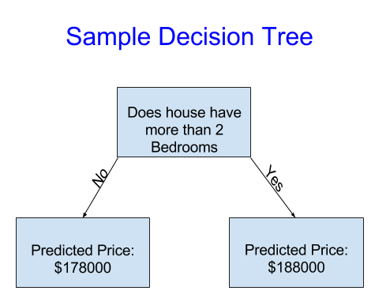

# Introduction
how machine learning models work and how they are used. some basic of statistical modeling. **We'll start with a model called the Decision Tree**. There are fancier models that give more accurate predictions. But decision trees are easy to understand, and **they are the basic building block for some of the best models in data science**.

The predicted price for any house under consideration is the historical average price of houses in the same category.

Fitting or training the model is called the training data. After the model has been fit, you can apply it to new data to predict prices of additional homes.

Capture more factors affecting the prediction to be more accurate. You can capture more factors using a tree that has more "splits." These are called "deeper" trees.

# Using Pandas
You'll use the Pandas library for this course.
~~~
import pandas as pd
~~~
The most important part of the Pandas library is the DataFrame. A DataFrame holds the type of data you might think of as a table. This is similar to a sheet in Excel, or a table in a SQL database.
  * pd.read_csv(file_path) || data = pd.read_csv(madrid_rent)
    + read the data and store data in DataFrame titled data
  * .describe() || data.describe()
    + print a summary of the data in data
  * Pandas Table Rows
    + count : shows how many rows have non-missing values.
    + mean : the average.
    + std (standard deviation) : measures how numerically spread out the values are.
    + min, 25%, 50%, 75% and max :

# Selecting Data for Modeling
To choose variables/columns, we'll need to see a list of all columns in the dataset. That is done with the columns property of the DataFrame.
~~~
import pandas as pd

file_path = '../madrid_rent.csv'
fhand = pd.read_csv(file_path)
fhand.columns
>>> Index(['Suburb', 'Address', 'Rooms', 'Type', 'Price', 'Method', 'SellerG', 'Date', 'Distance', 'Postcode', 'Bedroom2', 'Bathroom', 'Car', 'Landsize', 'BuildingArea', 'YearBuilt', 'CouncilArea', 'Lattitude', 'Longtitude', 'Regionname', 'Propertycount'], dtype='object')
~~~

### Cleaning Data Trick
Your data has some missing values (some houses for which some variables weren't recorded.). The simplest option is drop houses from our data. The code is:
~~~
# drop from the data missing values that cause errors in processes
clean_data = fhand.dropna(axis=0)
~~~

## Selecting The Prediction Target (y)
We use dot notation to select the "prediction target" (y) and pull out the variable. This single column is stored in a Series, which is broadly like a DataFrame with only a single column of data.
~~~
# we want to predict Price
y = clean_data.Price
~~~

## Choosing "Features" (x)
The columns are called "features" (x) and would be used to determine the price. We select multiple features by providing a list of column names inside brackets. Each item in that list should be a string (with quotes).
~~~
columns = ['Rooms','Bathroom','Landsize','Lattitude','Longtitude']
x = clean_data[columns]
# let's review the data we have selected
x.describe()
~~~
.png)

~~~
x.head()
~~~
.png)

# Building Your Model (Scikit-learn - sklearn)
You will use the scikit-learn library to create your models. Scikit-learn is easily the most popular library for modeling the types of data typically stored in DataFrames. When coding, this library is written as sklearn, as you will see in the sample code.

The steps to building and using a model are:
  * Define: What type of model will it be? A decision tree? Some other type of model? Some other parameters of the model type are specified too.
  * Fit: Capture patterns from provided data. This is the heart of modeling.
  * Predict: Just what it sounds like
  * Evaluate: Determine how accurate the model's predictions are.

~~~
import pandas as pd
from sklearn.tree import DecisionTreeRegressor

fpath = "mdrent.csv"
fhand = pd.read_csv(fpath)
clean = fhand.dropna(axis=0)
y = clean.Price
# select columns and values
columns = ['Rooms','Bathroom','Landsize','Lattitude','Longtitude']
x = clean[columns]

# Define the model to use
model = DecisionTreeRegressor(random_state=1)
# Fit model
model.fit(x,y)

# select the values of the data to be predicted
new_data = x.head()
# make the rediction (y has been loaded in fit step)
prediction = model.predict(new_data)
>>> [1035000. 1465000. 1600000. 1876000. 1636000.]
~~~

## Model Validation
Model validation measure the quality of your model. Measuring model quality is the key to iteratively improving your models.

In most (though not all) applications, the relevant measure of model quality is predictive accuracy. In other words, will the model's predictions be close to what actually happens.

There are many metrics for summarizing model quality, but we'll start with one called **Mean Absolute Error (also called MAE)**. Let's break down this metric starting with the last word, error. The prediction error for each house is: **error=actual−predicted**. So, if a house cost $150,000 and you predicted it would cost $100,000 the error is $50,000.

With the MAE metric, we take the absolute value of each error. **This converts each error to a positive number**. We then take the average of those absolute errors. **This is our measure of model quality**. In plain English, it can be **said as : On average, our predictions are off by about n**.
Here is how we calculate the mean absolute error:
~~~
import pandas as pd
from sklearn.tree import DecisionTreeRegressor
from sklearn.metrics import mean_absolute_error

# load & clean
fpath = "../mdrent.csv"
fhand = pd.read_csv(fpath)
clean = fhand.dropna(axis=0)

# fit
y = clean.Price
columns = ['Rooms','Bathroom','Landsize','Lattitude','Longtitude']
x = clean[columns]
model = DecisionTreeRegressor()
model.fit(x,y)

# predict
new_data = x.head()
prediction = model.predict(new_data)

# MEAN Absolute Error
mean_absolute_error(y, prediction)
>>> 434.71594577146544
~~~

## The Problem with "In-Sample" Scores
The measure we just computed can be called an "in-sample" score. We used a single "sample" of houses for both building the model and evaluating it. **Here's why this is bad:**

Imagine that, in the large real estate market, **door color is unrelated to home price**. However, all homes with **green doors were very expensive in the sample of data** you used to build the model. The model's job is to find patterns that predict home prices, so it will see **this pattern, and it will always predict high prices for homes with green doors**. Since this pattern was derived from the training data, **the model will appear accurate in the training data**. But if this pattern doesn't hold when the model sees new data, the model would be very inaccurate when used in practice.

Since models' practical value come from making predictions on new data, **we have to measure performance on data that wasn't used to build the model**. The most straightforward way to do this is to **exclude some data from the model-building process, and then use those to test the model's accuracy** on data it hasn't seen before. **This data is called validation data**.

The scikit-learn library has a function train_test_split to break up the data into two pieces. We'll use some of that data as training data to fit the model, and we'll use the other data as validation data to calculate mean_absolute_error.
~~~
import pandas as pd
from sklearn.tree import DecisionTreeRegressor
from sklearn.metrics import mean_absolute_error
from sklearn.model_selection import train_test_split

# clean data
fpath = "mdrent.csv"
fhand = pd.read_csv(fpath)
clean = fhand.dropna(axis=0)

# target variable & predictor variable
y = clean.Prices
columns = ['Rooms','Bathroom','Landsize','Lattitude','Longtitude']
x = clean[columns]

# fit
train_x, vtion_x, train_y, vtion_y = train_test_split(x,y,random_state=0)
model = DecisionTreeRegressor()
model.fit(train_x,train_y)

# prediction on validation data
vtion_predictions = model.predict(vtion_x)
mean_absolute_error(vtion_y,vtion_predictions)
>>> 263007.8766946417
~~~

Your mean absolute error for the in-sample data was about 500 dollars. Out-of-sample it is more than 250,000 dollars. This is the difference between a model that is almost exactly right, and one that is unusable for most practical purposes. As a point of reference, the average home value in the validation data is 1.1 million dollars. So the error in new data is about a quarter of the average home value.

## underfitting and overfitting
Apply these ideas to make your models more accurate. Experiment with alternative models and see which gives the best predictions it's determined the tree's depth (how many splits it makes before coming to a prediction).

As the tree gets deeper, the dataset gets sliced up into leaves with fewer houses. Each level of the tree splits the data into 2 leaves or groups, adding more splits at each level represent 2^n (2 leaves at n levels). In practice, it's not uncommon for a tree to have 10 splits between the top level (all houses) and a leaf (1024 leaves).

When we divide the houses amongst many leaves, we also have **fewer houses in each leaf**. Leaves with very few houses will make predictions that are quite close to those homes' actual values, but they may **make very unreliable predictions for new data** (because each prediction is based on only a few houses).

**This is a phenomenon called overfitting**, where a model matches the training data almost perfectly, but does poorly in validation and other new data.

On the flip side, **if we make our tree very shallow, it doesn't divide up the houses into very distinct groups**. At an extreme, if a tree divides houses into only 2 or 4, each group still has a wide variety of houses. Resulting predictions may be far off for most houses, even in the training data (and it will be bad in validation too for the same reason). **When a model fails to capture important distinctions and patterns in the data, so it performs poorly even in training data, that is called underfitting**.

**We want to find the sweet spot between underfitting and overfitting**.

### max_leaf_nodes
For controlling the tree depth, the max_leaf_nodes argument provides a very sensible way to control overfitting vs underfitting.
~~~
import pandas as pd
from sklearn.tree import DecisionTreeRegressor
from sklearn.metrics import mean_absolute_error

# file
fpath = "mdrent.csv"
fhand = pd.read_csv(fpath)
clean = fhand.dropna(axis=0)

# target and predictor variables
y = clean.Price
columns = ['Rooms','Bathroom','Landsize','Lattitude','Longtitude']
x = clean[columns]

# training & validation data
train_x, vtion_x, train_y, vtion_y = train_test_split(x, y, random_state = 0)

# compare MAE scores
def get_mae(max_leaf_nodes, train_x,vtion_x,train_y,vtion_y):
  model = DecisionTreeRegressor(max_leaf_nodes=max_leaf_nodes,random_state=0)
  model.fit(train_x,train_y)
  prediction = model.predict(vtion_y)
  mae = mean_absolute_error(vtion_y,prediction)
  return mae

# compare MAE with differing values of max_leaf_nodes
for max_leaf_nodes in [5, 50, 500, 5000]:
  nw_mae = get_mae(max_leaf_nodes,train_x,vtion_x,train_y,vtion_y)
  print("Max leaf nodes: %d \t\t Mean Absolute Error: %d" %(max_leaf_nodes,nw_mae))

>>> Max leaf nodes: 5  		 Mean Absolute Error:  347380
>>> Max leaf nodes: 50  		 Mean Absolute Error:  258171
>>> Max leaf nodes: 500  		 Mean Absolute Error:  243495
>>> Max leaf nodes: 5000  		 Mean Absolute Error:  254983
~~~

Overfitting: capturing spurious patterns that won't recur in the future, leading to less accurate predictions.

Underfitting: failing to capture relevant patterns, again leading to less accurate predictions.

We use validation data, which isn't used in model training, to measure a candidate model's accuracy. This lets us try many candidate models and keep the best one.

# Random Forest
Random Forest can lead to better performance because uses many trees and it makes a prediction by averaging the predictions of each component tree. It generally has much **better predictive accuracy** than a single decision tree. There are models with better performance but many of those are sensitive to getting the right parameters, the Random Forest model **works well with default parameters**.
~~~
import pandas as pd
from sklearn.metrics import mean_absolute_error
from sklearn.modele_selection import train_test_split
from sklearn.ensemble import RandomForestRegressor

# load file
fpath = "mdrent.csv"
fhand = pd.read_csv(fpath)
clean = fhand.dropna(axis=0)

# target & predictor variables
y = clean.Price
columns = ['Rooms','Bathroom','Landsize','Lattitude','Longtitude']
x = clean[columns]

# training & validation data
train_x, vtion_x, train_y, vtion_y = train_test_split(x, y, random_state = 0)

# fit
model = RandomForestRegressor(random_state = 1)
model.fit(train_x, train_y)

# prediction
prediction = model.predict(vtion_x)
mean_absolute_error(vtion_y,prediction)
>>> 191669.7536453626
~~~
A big improvement over the best decision tree error of 250,000.

#
