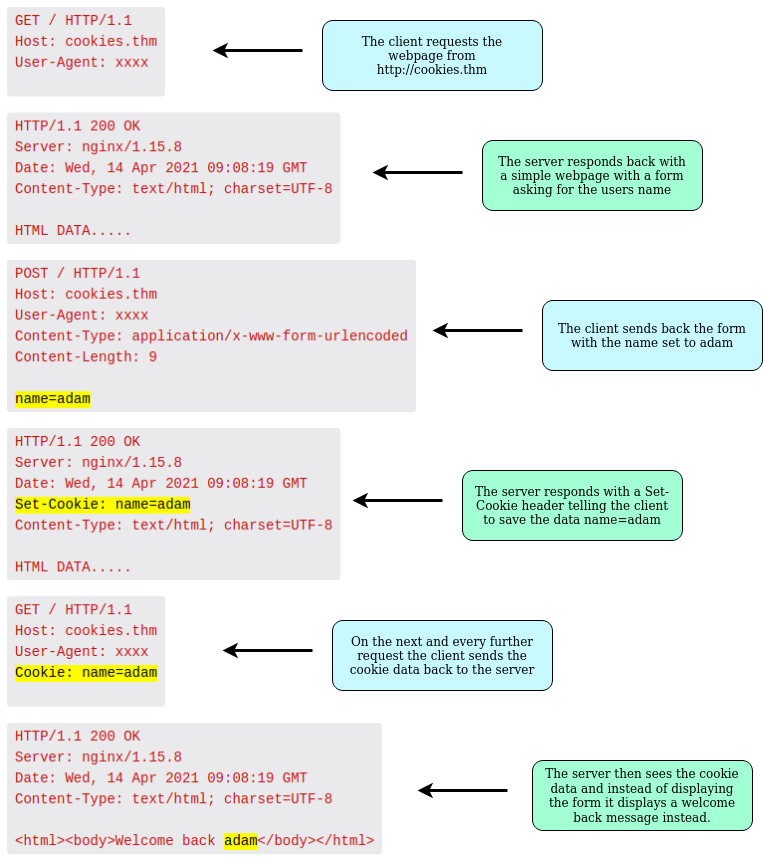
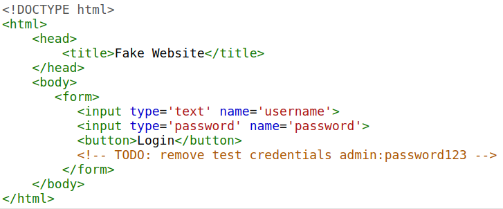

# How Website flows

when you request a website, your computer needs to know the server's IP address it needs to talk to; for this, it uses DNS. Your computer then talks to the web server using a special set of commands called the HTTP protocol; the webserver then returns HTML, JavaScript, CSS, Images, etc., which your browser then uses to correctly format and display the website to you.


## Components
### Load Balancers
When a website's traffic starts getting quite large or is running an application that needs to have high availability, one web server might no longer do the job. Load balancers provide two main features, ensuring high traffic websites can handle the load and providing a failover if a server becomes unresponsive.
When you request a website with a load balancer, the load balancer will receive your request first and then forward it to one of the multiple servers behind it. The load balancer uses different algorithms to help it decide which server is best to deal with the request. A couple of examples of these algorithms are round-robin, which sends it to each server in turn, or weighted, which checks how many requests a server is currently dealing with and sends it to the least busy server.

Load balancers also perform periodic checks with each server to ensure they are running correctly; this is called a health check. If a server doesn't respond appropriately or doesn't respond, the load balancer will stop sending traffic until it responds appropriately again.


### CDN (Content Delivery Networks)
A CDN can be an excellent resource for cutting down traffic to a busy website. It allows you to host static files from your website, such a JavaScript, CSS, Images, Videos, and host them across thousands of servers all over the world. When a user requests one of the hosted files, the CDN works out where the nearest server is physically located and sends the request there instead of potentially the other side of the world.

### Databases
Often websites will need a way of storing information for their users. Webservers can communicate with databases to store and recall data from them. Databases can range from just a simple plain text file up to complex clusters of multiple servers providing speed and resilience. You'll come across some common databases: MySQL, MSSQL, MongoDB, GraphQL, Postgres, and more; each has its specific features.

### WAF (Web Application Firewall)
A WAF sits between your web request and the web server; its primary purpose is to protect the webserver from hacking or denial of service attacks. It analyses the web requests for common attack techniques, whether the request is from a real browser rather than a bot. It also checks if an excessive amount of web requests are being sent by utilising something called rate limiting, which will only allow a certain amount of requests from an IP per second. If a request is deemed a potential attack, it will be dropped and never sent to the webserver.


# HTTP 

## Making a Request
Example Request:
```
GET / HTTP/1.1
Host: tryhackme.com
User-Agent: Mozilla/5.0 Firefox/87.0
Referer: https://tryhackme.com/
To breakdown each line of this request:
```
* Line 1: This request is sending the GET method ( more on this in the HTTP Methods task ), request the home page with / and telling the web server we are using HTTP protocol version 1.1.

* Line 2: We tell the web server we want the website tryhackme.com

* Line 3: We tell the web server we are using the Firefox version 87 Browser

* Line 4: We are telling the web server that the web page that referred us to this one is `https://tryhackme.com`

* Line 5: HTTP requests always end with a blank line to inform the web server that the request has finished.


## Example Response:

```
HTTP/1.1 200 OK
Server: nginx/1.15.8
Date: Fri, 09 Apr 2021 13:34:03 GMT
Content-Type: text/html
Content-Length: 98

<html>
<head>
    <title>TryHackMe</title>
</head>
<body>
    Welcome To TryHackMe.com
</body>
</html>
```

To breakdown each line of the response:

* Line 1: HTTP 1.1 is the version of the HTTP protocol the server is using and then followed by the HTTP Status Code in this case "200 Ok" which tells us the request has completed successfully.

* Line 2: This tells us the web server software and version number.

* Line 3: The current date, time and timezone of the web server.

* Line 4: The Content-Type header tells the client what sort of information is going to be sent, such as HTML, images, videos, pdf, XML.

* Line 5: Content-Length tells the client how long the response is, this way we can confirm no data is missing.

* Line 6: HTTP response contains a blank line to confirm the end of the HTTP response.

* Lines 7-14: The information that has been requested, in this instance the homepage.


# Headers
Headers are additional bits of data you can send to the web server when making requests.

Although no headers are strictly required when making a HTTP request, you’ll find it difficult to view a website properly.

## Common Request Headers

These are headers that are sent from the client (usually your browser) to the server.

### Host:
Some web servers host multiple websites so by providing the host headers you can tell it which one you require, otherwise you'll just receive the default website for the server.

### User-Agent: 
This is your browser software and version number, telling the web server your browser software helps it format the website properly for your browser and also some elements of HTML, JavaScript and CSS are only available in certain browsers.

### Content-Length: 
When sending data to a web server such as in a form, the content length tells the web server how much data to expect in the web request. This way the server can ensure it isn't missing any data.

### Accept-Encoding: 
Tells the web server what types of compression methods the browser supports so the data can be made smaller for transmitting over the internet.


### Cookie: 
Data sent to the server to help remember your information (see cookies task for more information).


## Common Response Headers
These are the headers that are returned to the client from the server after a request.

### Set-Cookie: 
Information to store which gets sent back to the web server on each request (see cookies task for more information).

### Cache-Control: 
How long to store the content of the response in the browser's cache before it requests it again.

### Content-Type: 
This tells the client what type of data is being returned, i.e., HTML, CSS, JavaScript, Images, PDF, Video, etc. Using the content-type header the browser then knows how to process the data.

### Content-Encoding: 
What method has been used to compress the data to make it smaller when sending it over the internet.


# HTTP Responses

### 100-199 - Information Response
These are sent to tell the client the first part of their request has been accepted and they should continue sending the rest of their request. These codes are no longer very common.

### 200-299 - Success
This range of status codes is used to tell the client their request was successful.

### 300-399 - Redirection
These are used to redirect the client's request to another resource. This can be either to a different webpage or a different website altogether.

### 400-499 - Client Errors
Used to inform the client that there was an error with their request.

### 500-599 - Server Errors
This is reserved for errors happening on the server-side and usually indicate quite a major problem with the server handling the request.


# Common HTTP Status Codes:
There are a lot of different HTTP status codes and that's not including the fact that applications can even define their own, we'll go over the most common HTTP responses you are likely to come across:

## 200 - OK
The request was completed successfully.

## 201 - Created
A resource has been created (for example a new user or new blog post).

## 301 - Permanent Redirect
This redirects the client's browser to a new webpage or tells search engines that the page has moved somewhere else and to look there instead.

## 302 - Temporary Redirect
Similar to the above permanent redirect, but as the name suggests, this is only a temporary change and it may change again in the near future.

## 400 - Bad Request
This tells the browser that something was either wrong or missing in their request. This could sometimes be used if the web server resource that is being requested expected a certain parameter that the client didn't send.

## 401 - Not Authorised
You are not currently allowed to view this resource until you have authorised with the web application, most commonly with a username and password.

## 403 - Forbidden
You do not have permission to view this resource whether you are logged in or not.

## 405 - Method Not Allowed
The resource does not allow this method request, for example, you send a GET request to the resource /create-account when it was expecting a POST request instead.

## 404 - Page Not Found
The page/resource you requested does not exist.

## 500 - Internal Service Error
The server has encountered some kind of error with your request that it doesn't know how to handle properly.

## 503 - Service Unavailable	
This server cannot handle your request as it's either overloaded or down for maintenance.


# Cookies
You've probably heard of cookies before, they're just a small piece of data that is stored on your computer. Cookies are saved when you receive a "Set-Cookie" header from a web server. Then every further request you make, you'll send the cookie data back to the web server. Because HTTP is stateless (doesn't keep track of your previous requests), cookies can be used to remind the web server who you are, some personal settings for the website or whether you've been to the website before. Let's take a look at this as an example HTTP request:



Cookies can be used for many purposes but are most commonly used for website authentication. The cookie value won't usually be a clear-text string where you can see the password, but a token (unique secret code that isn't easily humanly guessable).


# Sensitive Data Exposure
**Sensitive Data Exposure occurs when a website doesn't properly protect (or remove) sensitive clear-text information to the end-user; usually found in a site's frontend source code.**

We now know that websites are built using many HTML elements (tags), all of which we can see simply by "viewing the page source". A website developer may have forgotten to remove login credentials, hidden links to private parts of the website or other sensitive data shown in HTML or JavaScript.

Sensitive information can be potentially leveraged to further an attacker's access within different parts of a web application. For example, there could be HTML comments with temporary login credentials, and if you viewed the page's source code and found this, you could use these credentials to log in elsewhere on the application (or worse, used to access other backend components of the site).

**Whenever you're assessing a web application for security issues, one of the first things you should do is review the page source code to see if you can find any exposed login credentials or hidden links.**




