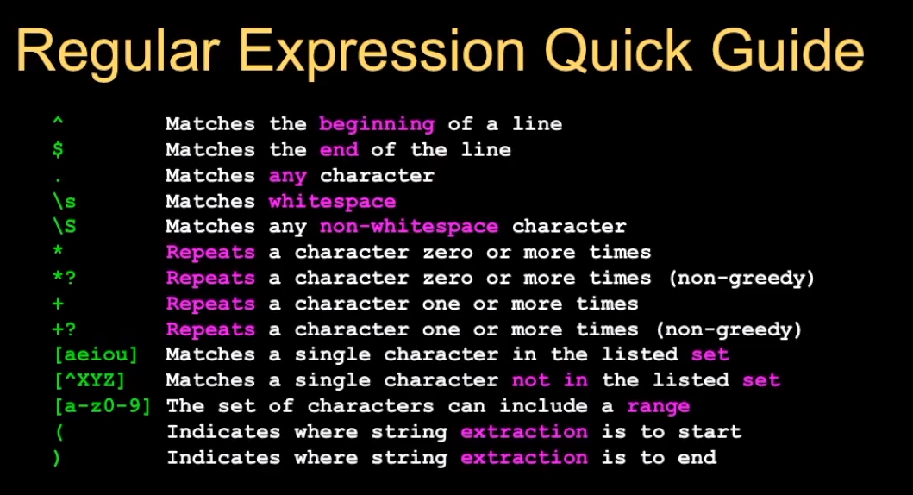

# Apuntes : Scientific Computing (fcc_sc)

## Loops and Iterations
  * 4 patrones basicos :
    + sequential
    + conditional
    + store and reuse
    + loops and iterations.

### Making "smart" loops
The trick is "knowing" something about the whole loop when you are stuck writing code that only sees one entry at a time.

~~~
Set some variables to initial values

for  thing in data:
  * Look for something or do something to each entry separately,
  * Updating a variable
Look at the variables
~~~

#### Looping through a Set

~~~
print('Before')
for thing in [9, 42, 12, 3, 74, 15] :
  print(thing)
print('After')

>>> Before
>>> 9
>>> 41
>>> 12
>>> 3
>>> 74
>>> 15
>>> After
~~~

#### Finding the largest value
The pattern is:
~~~
largest_so_far = -1
print('Before', largest_so_far)
for the_num in [9, 41, 12, 3, 74, 15] :
    if the_num > largest_so_far :
        largest_so_far = the_num
    print(largest_so_far, the_num)

# print('After',largest_so_far)

>>> Before -1
>>> 9 9
>>> 41 41
>>> 41 12
>>> 41 3
>>> 74 74
>>> 74 15
>>> After 74
~~~

#### Counting in a Loop
The pattern is:
Set zero at the begging, add one to it. In essence is how many times a line of the loop ran.
~~~
count = 0
sum = 0
print('Before', count, sum)
for value in [9, 41, 12, 3, 74, 15] :
  count = count + 1
  sum = sum + value
  average = sum / count
  print(count, sum, value)
print('After', count, sum, average)

>>> Before 0 0
>>> 1 9 9
>>> 2 50 41
>>> 3 62 12
>>> 4 65 3
>>> 5 139 74
>>> 6 154 15
>>> After 6 154 25.666
~~~

#### Filtering in a Loop
The pattern is:
~~~
print('Before')
for value in [9, 41, 12, 3, 74, 15] :
  if value > 20:
    print('Large number', value)
print('After')

>>> Before
>>> Large number 41
>>> Large number 74
>>> After
~~~

#### Looping Through Strings
  * len() built-in function
    + how long string is, return int
    + 0 to len - 1
  * index operator []
    + fruit[1] : a

~~~
fruit = 'banana'
index = 0
while index < len(fruit):
  letter = fruit[index]
  print(index, letter)
  index = index + 1

~~~

#### Orientation
> Anytime that will be possible to use a while loop and a for loop we choose the for loop

Its more elegant because the less code you write the less chance to make a mistake. In that way is more efficient.

##### Looping and Counting
A conditional in a count. What we found equal to true, we capture.
The pattern is:
~~~
word = 'banana'
count = 0
for letter in word :
  if letter == 'a' :
  count = count + 1
print(count)
~~~

### Slicing String
  * We can also look at any continuos section of a string using a **colon operator**
  * The second number is one beyond the end of the slice ("up to but no including")
  * If the second number is beyond the end of the string, it stops at the end

~~~
s = 'Monty Python'
print(s[0:4])
>>> Mont

print(s[6:7])
>>> P

print(s[6:20])
Python
~~~

If we leave off the first number or the last number of the slice, it is assumed to be the beginning or end of the string respectively.

~~~
s = 'Monty Python'
print(s[:2])
>>> Mo

print(s[8:])
>>> thon

print(s[:])
>>> Monty Python
~~~

### Using in as a logical Operator
  * The in keyword can also be used to check to see if one string is in another string
  * The in expression is a logical expression that returns True or False and can be used in an if statement

~~~
fruit = 'banana'
'n' in fruit
>>> True

'm' in fruit
>>> False

'nan' in fruit
>>> True

if 'a' in fruit :
  print('Found it!')
>>> Found it!
~~~

## String Library
These functions are already built into every string. These functionsdo not modify the original string, instead they return a new string that has been altered.

~~~
greet = 'Hello Bob'
zap = greet.lower()
print(zapo)
>>> hello bob
~~~
#### dir() (Strings)
It shows all the methods which could be applied to.
~~~
stuff = 'Hello world'
type(stuff)
>>> <class 'str'>
dir(stuff)
>>> all the methods which could be apllied to <class 'str'>
~~~

### Searching a string
We use the **find()** function to search a substring within another string.
Finds the position of the first occurrence of the substring. If is not found returns -1.
~~~
fruit = 'banana'
pos = fruit.find('na')
print(pos)
>>> 2

aa = fruit.find('z')
>>> -1
~~~

### Search and Replace
It replaces all the occurrences of the search string with the replacement string.
~~~
greet = 'Hello Bob'
nstr = greet.replace('Bob','Jane')
>>> Hello Jane
~~~

### Stripping Whitespace
  * strip() : remove whitespace at left & right
    + lstrip() : remove whitespace at the left
    + rstrip() : remove whitespace at the right

~~~
greet = '   Hello Bob     '
greet.lstrip()
>>> 'Hello Bob    '
greet.rstrip()
>>> '   Hello Bob'
greet.strip()
>>> 'Hello Bob'
~~~

## Parsig and Extracting
Extract the host from an Email header.
The pattern is:
~~~
data = 'From stephen.marquard@uct.ac.za Sat Jan 5 09:14:16 2008'

atpos = data.find('@')
print(atpos)
>>> 21

sppos = data.find(' ', atpos)
print(sppos)
>>> 31

host = data[atpos + 1 : sppos]
print(host)
>>> uct.ac.za
~~~

## Opening a file
Before we can read the contents of a file, we must tell Python which file we are going to work with and what we will be doing with he file.

  * this is done with the **open()** function
open() returns a file handle - a variable used to perform operations on the file.
Similar to "File->Open" in a Word Processor.

  * The parameters of open(filename, mode) are:
    + Required: filename
    + Optional: to read it ('r') or write it ('w').

If we open() a file without mode, the default mode is "read-only".

~~~
fhand = open('mbox.txt', 'r')
~~~

#### What is a hanlde?
~~~
fhand = open('mbox.txt')
print(fhand)
>>> <_io.TextIOWrapper name='mbox.txt' mode='r' encoding='UTF-8'>
~~~
open() is not the file itself, is a kind of wrapper that allow us to hanlde the file object.

#### File Handle as a Sequence
A file handle open for read can be trated as a sequence of strings where each line in the file is a string in the sequence.

We can use the for statements to iterate through a sequence.

Remember -  a sequence is an ordered set.

~~~
fhand = open('mbox.txt')
for line in fhand :
  print(line)
~~~

### Counting Lines in a File
We use a count pattern.
The pattern is:
~~~
fhand = open('mbox.txt')
count = 0
for line in fhand:
  count = count + 1
print('Line Count:', count)
>>> Line Count: 132045
~~~

### Searching through a File
We lets see through try an error the most optimal pattern to search in a file.

The pattern is: loop with a filter

~~~
# error
fhand = open('mbox-short.txt')
for line in fhand:
  if line.startswith('From:')
    print(line)
>>> From: mkie@.... \n
\n
>>> From: mkie@.... \n
\n
>>> From: mkie@.... \n
~~~
This pattern give us the data separate by blank lines:

From: mkie@....

From: mkie@....

From: mkie@....

This is because of the "new line" character and the print() that adds a new line. So, how we fix this?

  * rstrip() : removes whitespace at right

### Fixed Searching through a File pattern
~~~
# fixed 1
fhand = open('mbox-short.txt')
for line in fhand:
  line = line.rstrip()
  if line.startswith('From:') :
    print(line)
>>> From: mkie@....
>>> From: mkie@....
>>> From: mkie@....
~~~

### Skip pattern
We can build the same loop from a different point of view. Like "if line is not starts with 'From:' skipp it"

~~~
# optimal
fhand = open('mbox-short.txt')
for line in fhand :
  line = line.rstrip()
  if not line.startswith('From') :
    continue
  print(line)
~~~

#### Using 'in' to select line
We can look for a string anywhere in a line as our selection criteria.

~~~
fhand = open(mbox-short.txt)
for line in fhand :
  line = line.rstrip()
  if not '#uct.ac.za' in line :
    continue
  print(line)
~~~

#### Prompt for File Name
We can include an input to get the file name, then we can predict at this point the software could fail. So, we can include a try/except block to handle errors.

~~~
fname = input('Enter the file name:')
fhand = open(fname)
for line in fhand :
  if not line.startswith('Subject:') :
    continue
  count = count + 1
print('There were', count, 'subject lines in', fname)
~~~

> Most of the programs in this course are going to be guided for the mnemotechnique rule for looping of:
**open for our strip, look for, and do something.**

## Data Structures

### Lists
  * List are 'mutable', we can change an element using the index operator.
  * List index their entries based on the position in the list.

#### Special functions to loop through List
  * len() : give us the lenght of the list.
  * range() : returns a list of numbers that range from zero to one less than the parameter.
    + We can construct an index loop using "for" and an integer iterator.

~~~
print(range(4))
>>> [0, 1, 2, 3]

friends = ['Joseph', 'Glenn', 'Sally']
print(len(friends))
>>> 3

print(range(len(friends)))
>>> [0, 1, 2]
~~~

##### Loop through a List
We can loop through a List in two ways, both acceptable. We choose one or the other if we want to know the actual position in each iteration of the loop.

~~~
friends = ['Joseph', 'Glenn', 'Sally']

# simple loop : unknow position
for friend in friends:
  print('Happy New Year', friend)

# advanced loop: known position (i)
for i in friends:
  friend = friends[i]
  print('Happy New Year', friend)
~~~

#### Concatenating List using +
We can create a new list by adding two existing list together.
~~~
a = [1, 2, 3]
b = [4, 5, 6]
c = a + b
print(c)
>>> [1, 2, 3, 4, 5, 6]
~~~

#### List sliced using : (colon)
Just like string the second number means "up to but not including".
~~~
t = [1, 2, 3, 4, 5, 6]
print(t[1:3])
>>> [2,3]

print(t[:4])
>>> [1, 2, 3, 4]

print(t[3:])
>>> [4, 5, 6]

print(t[:])
>>> [1, 2, 3, 4, 5, 6]
~~~~

#### dir() (Lists)
It shows all the methods which could be applied to.

#### Building a List from scratch
We can create an empty list and then add elements using the append method.

The list stays in order and new elements are added at the end of the list.

~~~
stuff = list()
stuff.append('book')
stuff.append(99)
print(stuff)
>>> ['book', 99]

stuff.append('cookie')
print(stuff)
>>> ['book', 99, 'cookie']
~~~

#### Is something in a List?
Python provides two operators that let you check if an item is in a list. There are logical operators that return True or False. They do not modify the list.
  * in
  * not in

~~~
some = ['book', 99, 'cookie']
99 in some
>>> True

15 in some
>>> False

20 not in some
>>> True
~~~

#### Techniques to Calculation with Lists:
Both codes gives the same output. The first use less memory because it do not save the values in memory, the second it does.

~~~
# advanced loop calculation pattern
total = 0
count = 0
while True :
  inp = input('Enter a number: ')
  if inp == 'done' : break
  try :
    value = float(inp)
  except:
    print('Enter a valid number')
    quit()
  total = total + value
  count = count + 1
average = total / count
print('Average:', average)
~~~

~~~
numlist = list()
while True :
  inp = input('Enter a number')
  if inp == 'done' : break
  value = float(inp)
  numlist.append(value)
average = sum(numlist) / len(numlist)
print('Average:', average)
~~~

#### Strings and Lists
Split breaks a string into parts and produces a list of strings. We think of these as words. We can access a particular word or loop through all the words.
~~~
abc = 'With three words'
stuff = abc.split()
print(stuff)
>>> ['With', 'three', 'words']

print(len(stuff))
>>> 3

print(stuff[0])
>>> With

for w in stuff :
  print(w)
>>> With
>>> three
>>> words
~~~

##### Split parameters
When you do not specify a delimiter, multiple spaces are treated like one delimiter.

You can specify what delimiter character to use in the splitting.
~~~
line = 'A lot     of spaces'
etc = line.split()
print(etc)
>>> ['A', 'lot', 'of', 'spaces']

line = 'first;second;third'
thing = line.split()
>>> ['first;second;third']
print(len(thing))
>>> 1
thing = line.split(';')
print(thing)
>>> ['first','second','third']
print(len(thing))
>>> 3
~~~

### Filtering with Split
The pattern is:
~~~
# extract Day
# From stephen.marquard@uct.ac.za Sat Jan 5 09:14:16 2008 (and similar lines)

fhand = open('mbox-short')
for line fhand :
  line = line.rstrip()
  if not line.startswith('From ') : continue
  words = line.split()
  print(words[2])
>>> Sat
>>> Fri
>>> Fri
~~~

~~~
line = 'From stephen.marquard@uct.ac.za Sat Jan 5 09:14:16 2008'
words = line.split()
print(words)
>>> ['From', 'stephen.marquard@uct.ac.za', 'Sat', 'Jan', '5', '09:14:16', '2008']
~~~

#### The Double Split Pattern
The pattern is:
~~~
# get the host
line = 'From stephen.marquard@uct.ac.za Sat Jan 5 09:14:16 2008'
words = line.split()
email = words[1]
pieces = email.split('@')
print(pieces)
>>> ['stephen.marquard', 'uct.ac.za']
print(pieces[1])
>>> ['uct.ac.za']
~~~

## Dictionary data structure (Asociative Array)
Dictionaries allow us to do fast database-like operations in Python.
  * Dictionaries are 'mutable', their values could be updated
  * Dictionaries are like lists except that Dictionary use keys instead of number to access their values.
    + Dictionaries data structure is similar to a JSON file

~~~
ddd = dict()
ddd['age'] = 21
ddd['course'] = 182
print(ddd)
>>> {'course':182, 'age':21}
ddd['age'] = 23
print(ddd)
>>> {'course':182, 'age':23}
~~~

### Dictionary Literals (Constants)
You can make an empty dictionary using empty curly braces.
~~~
jjj = {'chuck':1, 'fred':42}
ooo = {}
~~~

### Counters with Dictionary
One common use of dictionaries is counting how often we "see" something.
~~~
# the concept
counts = dict()
names = ['csev','cwen','cwen','zqian','csev']
for name in names :
  if name not in counts :
    counts[name] = 1
  else :
    counts[name] = counts[name] + 1
print(counts)
>>> {'cwen':2,'zqian':1,'csev':2}
~~~

The pattern is:
Checking to see if a key is already in a dictionary and assuming a default value if is not there.

  * get() : gives a default value if the key does not exist.
    + get(key, default)
    + get method : create a key with a default value in a dictionary and returns it.

~~~
counts = dict()
names = ['csev','cwen','cwen','zqian','csev']
if name in names :
  counts[name] = counts.get(name,0) + 1
print(counts)
~~~

### Counting Pattern
The genral attern to count the words in a line of text is to split the line into words, then loop through the words and use a dictionary to track the count of each word independently.
The pattern is:
~~~
counts = dict()
print('Enter a line of text:')
line = input('')

words = line.split()

print('Words:', words)

print('Counting...')
for word in words :
  counts[word] = counts.get(word,0) + 1
print('Counts', counts)
~~~

### Definte Loops and Dictionaries (Loop through keys and values)
We can write a for loop that goes through all the entries in a dictionary - actually it goes through all of the keys in the dictionary and looks up the values.
The pattern is:
~~~
counts = {'chuck':1, 'fred':42, 'jan':100}
for key in counts:
  print(key, counts[key])

>>> jan 100
>>> chuck 1
>>> fred 42

# Two iteration variables
# the first itereation is the key and the second is the value for that key
jjj = {'chuck':1, 'fred':42, 'jan':100}
for aaa,bbb in jjj.items() :
  print(aaa, bbb)
>>> jan 100
>>> chuck 1
>>> fred 42
~~~

#### Retrieving list of Keys and Values
You can get a list of keys, values or items (both) from a dictionary.
~~~
jjj = {'chuck':1, 'fred':42, 'jan':100}
# list method returns a list of keys
print(list(jjj))
>>> ['chuck', 'fred', 'jan']

print(jjj.keys())
# keys method returns a list of keys
>>> ['chuck', 'fred', 'jan']

print(jjj.values())
# values method returns a list of values
>>> ['1', '42', '100']

print(jjj.items())
>>> [('chuck':1), ('fred':42), ('jan':100)] --> a Tuple
~~~

### Read a file and count all the words in the file
The pattern is:
~~~
name = input('Enter filename:')
fhandle = open(name)

counts = dict()
for line in handle :
  words = line.split()
  for word in words :
    counts[word] = counts.get(word,0) + 1

bigcount = None
bigword = None
for word,count in counts.items():
  if bigcount is None or count > bigcount :
    bigword = word
    bigcount = count

print(bigword, bigcount)
~~~

## Tuples data structure
Tuples are another kind of sequence that functions much like a indexed list.
~~~
x = ('Gleen','Sally', 'Joseph')
print(x[2])
>>> Joseph

y = (1, 9, 2)
print(y)
>>> (1, 9, 2)
print(max(y))
>>> 9

for iter in y:
  print(iter)
>>> 1
>>> 9
>>> 2
~~~

### Tuples are Inmutable
Unlike lists, once you create a tuple, you cannot alter its contents - similar to a string.
The notion of inmutation affects operation like sort, append or reverse.
~~~
z = (9, 8, 7)
z[2] = 0
>>> Traceback error

z.sort()
>>> Traceback error
z.append()
>>> Traceback error
z.reverse()
>>> Traceback error
~~~

#### dir() (Tuples)
It shows all the methods which could be applied to.

#### Tuples are more efficient
Since Python does not have to build tuple structures to be modifiable, they are simpler and more efficient in terms of memory use and performance than list.

So in our program when we are making "temporary variables" we prefer tuples over lists.

### Tuples and Assignment
We can also put a tuple on the left-hand side of an assignment statement. We can even omit the parentheses.
~~~
(x,y) = (4, 'fred')
print(y)
>>> fred

a,b = (99,98)
print(a)
>>> 99
~~~

### Tuples and Dictionaries
The items() method in dictionaries return a list of (key, value) tuples.
~~~
d = dict()
d['csev'] = 2
d['cwen'] = 4
for (k,v) in d.items():
  print(k,v)
>>> csev 2
>>> cwen 4

tups = d.items()
print(tups)
>>> dict_items([('csev', 2), ('cwen', 4)])
~~~

#### Tuples are Comparable
The comparison operators work with tuples and other sequences. If the first item is equal, Python goes o to the next element, and so on, until it finds elements that differ.
~~~
# compare item by item : 0 < 5
(0,1,2) < (5,1,2)
>>> True

# compare item by item : 0 == 0, 1 < 3
(0,1,200000) < (0,3,4)
>>> True

# compare item by item : Jones == Jones, L from Sal comes before M from Sam
('Jones', 'Sally') < ('Jones', 'Sam')
>>> True

# compare item by item : J from Jones comes after A from Adams
('Jones', 'Sally') > ('Adams', 'Sam')
>>> True
~~~

### Sorting List of Tuples
We can take advantage of the ability to sort a list of tuples to get a sorted version of a dictionary. First we sort the dictionary by the key using the items() method + sorted() function.
~~~
d = {'a':10, 'c':22, 'b':1}
print('dic d: ',d)
print('itm d: ',d.items())
print('sor d: ',sorted(d.items()))

>>> dic d:  {'a': 10, 'c': 22, 'b': 1}
>>> itm d:  dict_items([('a', 10), ('c', 22), ('b', 1)])
>>> sor d:  [('a', 10), ('b', 1), ('c', 22)]
~~~

#### Using sorted()
We can do this even more directly using the built-in function sorted() that takes a sequence as a parameter and returns a sorted sequence.
~~~
d = {'a':10, 'c':22, 'b':1}
t = sorted(d.items())
>>> ('a', 10), ('b', 1), ('c', 22)

for k,v in sorted(d.items()):
  print(k,v)
>>> a 10
>>> b 1
>>> c 22
~~~

### Sort by values instead of key
If we could construct a list of tuples of the form (value, key) we could sort by value.

We do this with a for loop that creates a list of tuples.
~~~
c = {'a':10, 'c':22, 'b':1}
tmp = list()
for k,v in c.items() :
  temp.append( (v,k) )
  print(tmp)
>>> [(10,'a'), (22,'c'), (1,'b')]

tmp = sorted(tmp, reverse=True)
print(tmp)
>>> [(22,'c'), (10,'a'), (1,'b')]
~~~

### Pattern: Top Ten Most Common Words
The pattern is:
~~~
fhand = open('rome.txt')
counts = dict()

for line in fhand:
  words = line.split()
  for word in words:
    counts[word] = counts.get(word,0) + 1

lst = list()
for key,val in counts.items():
  newtup = (val,key)
  lst.append(newtup)

lst = sorted(lst,reverse=True)

for val,key in lst[:10]
  print(key,val)
~~~

#### Quick lambda version
The expression in terms of the data you want to see rather than the steps you want to take.
~~~
c = {'a':10, 'c':22, 'b':1}
print( sorted( [ (v,k) for k,v in c.items() ] ) )
~~~
List comprehension creates a dynamic list. In this case, we make a list of reverse tuples and then sort it.

## Regular Expressions : RegEx
A language of **marker characters**, programming with characters.

Provides a concise and flexible means **for matching patterns of characters**, strings of text, such a particular characters or words.

A regular expression is written in a formal language that can be interpreted by regular expression processor.

**There are characters that modify the inmediately preceding character**.

### Wild-Card Characters
  * The . (**dot**) character matches any character
    + If you add the * (**asterisk**) character, the character menas "any number of times"
  * Carrot (^) matches beginning of the line
  * Dash mayus S (\S) match any non-whitespace character
  * Plus symbol (+) means "one or more times". This character modify the inmediately preceding character.
  * [] gives a character
    + In between could include a set of allowed characters
    + [0-9] means "a single digit between 0 and 9"
    + plus modify the expression to match the same specification "one or more times".
      - [0-9]+ match any one or two digits in data "one or more times that the pattern match".
  * () Parentheses are not part of the match - but they tell where to start and stop what string to extract.
  *

~~~
X-Sieve: CMU Siee 2.3
X-DSPAM-Result: Innocent
X-DSPAM-Confidence: 0.8475
X-Contnt-Type-Message-Body: text/plain

# X and : matches itself (the x mayus and double colon)
# RegEx - Match the four of sentences
^X.*:

X-Sieve: CMU Siee 2.3
X-DSPAM-Result: Innocent
X-Plane is behind schedule: two weeks

# RegEx - First two sentences
^X-\S+:
~~~

### Matching and Extracting Data
  * re.search() returns a True/False depending on whether the string matches the regular expression
  * re.findall() matches strings to be extracted.

~~~
import re

x = 'My 2 favourite numbers are 19 and 42'
y = re.findall('[0-9]+',x)
print(y)
>>> ['2','19','42']
~~~

### Warning: Greedy Matching
The repeat character (* and +) push outward in both directions (greedy) to match the largest possible string.
~~~
import re

x = 'From: Using the : character'
y = re.findall('^F.+:',x)
print(y)
>>> ['From: Using the :']

# Greedy Matching
# ^F.+:
# .+: matches one or more characters "before the last double colon."

# Non-Greedy Matching
# ^F.+?:
# .+? matches one or more characters "but stop in short match or not greedy"
~~~

### Fine-Tuning String Extraction
You can refine the match for re.findall() and separately determine which portion of the match is to be extracted by using parentheses.

Parentheses are not part of the match - but they tell where to start and stop what string to extract.
~~~
x = 'From stephen.marquard@uct.ac.za Sat Jan 5 09:14:16 2008'
y = re.findall('\S+@\S+')
print(y)
>>> ['stephen.marquard@uct.ac.za']

# Tuning
z = re.findall('^From (\S+@\S+)', x)
print(z)
>>> ['stephen.marquard@uct.ac.za']

# Get the Host
# [^ ] match not non-blank characters * Match many of them
q = re.findall('@([^ ]*)', x)
print(q)
>>> ['uct.ac.za']

# Tuning
# .*@ any number of characters followeb by an @, then start extracting from @, non-blank characters any number of times.
q = re.findall('From .*@([^ ]*)', x)
print(q)
>>> ['uct.ac.za']
~~~

### Extracting Pattern : Spam Confidence
Extract the number corresponding to Spam Confidence.
~~~
import re

hand = open('mbox-short.txt')
numlist = list()

for line in hand:
  line = line.rstrip()
  stuff = re.findall('^X-DSPAM-Confidence: ([0-9.]+)', line)
  if len(stuff) != 1 : continue
  num = float(stuff[0])
  numlist.append(num)
print('Maximum:', max(numlist))
>>> X-DSPAM-Confidence: 0.8475

# [0-9.]+ -> A digit or period (dot), at least one or more times.
~~~

### Escape Character
If you want a special regular expression character to just behave normally (most of the time) you prefix it with '\'.
~~~
import re

x = 'We just received $10.100 for cookies.'
y = re.findall('\$[0-9.]+', x)
print(y)
>>> ['10.00']

# \$ -> a real dollar sign, not the regex meaning
~~~
